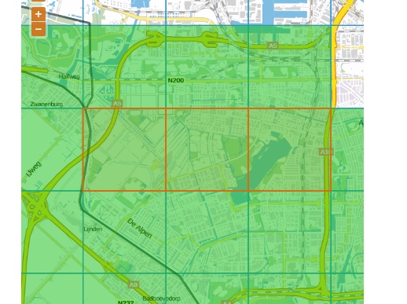

# Testcase meedere zips

Als je deze directory een aantal GML light zip neerzet dan wordt door de `BGTGMLLightLoaderNederlandTest` gepoogd deze te laden.

Zulke bestand kun je halen op: https://www.pdok.nl/nl/producten/pdok-downloads/download-basisregistratie-grootschalige-topografie.
Bijvoorbeeld:

  - blok 38468, level 0: https://www.pdok.nl/download/service/extract.zip?extractset=gmllight&tiles=%7B%22layers%22%3A%5B%7B%22aggregateLevel%22%3A0%2C%22codes%22%3A%5B38468%5D%7D%5D%7D&excludedtypes=plaatsbepalingspunt&history=true&enddate=22-4-2016
  - blok 38469, level 0: https://www.pdok.nl/download/service/extract.zip?extractset=gmllight&tiles=%7B%22layers%22%3A%5B%7B%22aggregateLevel%22%3A0%2C%22codes%22%3A%5B38469%5D%7D%5D%7D&excludedtypes=plaatsbepalingspunt&history=true&enddate=22-4-2016
  - blok 38480, level 0: https://www.pdok.nl/download/service/extract.zip?extractset=gmllight&tiles=%7B%22layers%22%3A%5B%7B%22aggregateLevel%22%3A0%2C%22codes%22%3A%5B38480%5D%7D%5D%7D&excludedtypes=plaatsbepalingspunt&history=true&enddate=22-4-2016
  - blokken 38126,38127,38138, level 0: https://www.pdok.nl/download/service/extract.zip?extractset=gmllight&tiles=%7B%22layers%22%3A%5B%7B%22aggregateLevel%22%3A0%2C%22codes%22%3A%5B38126%2C38127%2C38138%5D%7D%5D%7D&excludedtypes=plaatsbepalingspunt&history=true&enddate=22-4-2016

## download commando's

curl -o 38468_0-22-4-2016.zip "https://www.pdok.nl/download/service/extract.zip?extractset=gmllight&tiles=%7B%22layers%22%3A%5B%7B%22aggregateLevel%22%3A0%2C%22codes%22%3A%5B38468%5D%7D%5D%7D&excludedtypes=plaatsbepalingspunt&history=true&enddate=22-4-2016"

curl -o 38469_0-22-4-2016.zip "https://www.pdok.nl/download/service/extract.zip?extractset=gmllight&tiles=%7B%22layers%22%3A%5B%7B%22aggregateLevel%22%3A0%2C%22codes%22%3A%5B38469%5D%7D%5D%7D&excludedtypes=plaatsbepalingspunt&history=true&enddate=22-4-2016"

curl -o 38480_0-22-4-2016.zip "https://www.pdok.nl/download/service/extract.zip?extractset=gmllight&tiles=%7B%22layers%22%3A%5B%7B%22aggregateLevel%22%3A0%2C%22codes%22%3A%5B38480%5D%7D%5D%7D&excludedtypes=plaatsbepalingspunt&history=true&enddate=22-4-2016"

curl -o 38126-38127-38138_0-22-4-2016.zip "https://www.pdok.nl/download/service/extract.zip?extractset=gmllight&tiles=%7B%22layers%22%3A%5B%7B%22aggregateLevel%22%3A0%2C%22codes%22%3A%5B38126%2C38127%2C38138%5D%7D%5D%7D&excludedtypes=plaatsbepalingspunt&history=true&enddate=22-4-2016"
