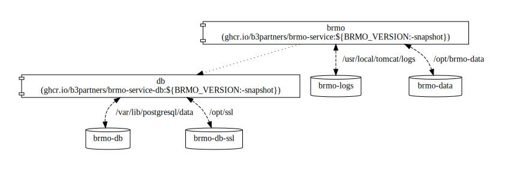

# BRMO docker

Een project om een dockerfile te maken met daarin een Tomcat instantie waarin :

- brmo-service als ROOT applicatie (http://localhost:8080/)
- postgis database

## build

Gebruik Maven:

```
mvn install -Dmaven.test.skip=true -B -V -e -fae -q
mvn clean deploy
```

(NB. voor `deploy` is authenticatie nodig middels `docker login` en een geldige `~/.m2/settings.xml`)

## run

Start een stack met de bijvoorbeeld volgende command line:

```shell
docker compose --env-file ./localhost.env \
         -p brmo-service up --always-recreate-deps --remove-orphans -d
```



### default TLS certificaten

De Docker image komt met een self-signed certificaat (serial no. `415c2f102c71a8e0be04aefaa1197238d1340ff6`,
common name: `brmo-db`) en private key; deze volstaan voor test doeleinden.
Het wordt aangeraden om een eigen certificaat en private key te gebruiken, hiervoor zijn omgevingsvariabelen en een
apart volume voorzien in de compose file.

Middels het script in `/opt/ssl/generate.sh` in de database container kan een nieuwe private key en certificaat worden
gegenereerd. Nadat het script is uitgevoerd dient de database container opnieuw te worden gestart.
Zie verder: 
- https://www.postgresql.org/docs/current/ssl-tcp.html

De juiste client-connect optie voor self-signed certificaten is `sslmode=require`; de server dwingt geen encryptie
van de verbinding af. Om encryptie af te dwingen te bewerkstelligen dient de `pg_hba.conf` te worden aangepast eea.
afhankelijk van oa. netwerk configuratie.
Bijvoorbeeld met het volgende commando:

```shell

```shell
vi /var/lib/postgresql/data/pg_hba.conf
```
Waarna de laatste regel `host all all all scram-sha-256` naar wens kan kan worden aangepast. Zie verder:
- https://www.postgresql.org/docs/current/auth-pg-hba-conf.html

### default password reset

Het default password van de brmo-service dient te worden aangepast voordat er data wordt geladen.
Gebruik de procedure op https://github.com/B3Partners/brmo/wiki/update-wachtwoord-procedure#versies-vanaf-210

```shell
# maak hash in de tomcat container
/usr/local/tomcat/bin/digest.sh -a PBKDF2WithHmacSHA512 -i 100000 -s 16 -k 256 -h "org.apache.catalina.realm.SecretKeyCredentialHandler" <STERK WACHTWOORD>
```

Update in de database container

```shell
# login staging db
PGPASSWORD=${DB_PASS_STAGING} psql -v ON_ERROR_STOP=1 --username staging --dbname staging
update gebruiker_ set wachtwoord = '<HASH>' where gebruikersnaam = 'brmo';
\q
```

### HR configuratie

De HR-configuratie heeft een PKI-Overheid certificaat en KvK truststore nodig om te kunnen communiceren met de HR API. 
Deze certificaten dienen in de directory `/opt/brmo-data/NHR/certificaten/` te worden geplaatst in PFX-formaat.
Na het kopiëren van de certificaten dient de brmo-service container opnieuw te worden gestart.
Dat kan met onderstaande commando's:

```shell
docker cp PKIOkeystore.pfx brmo-service-brmo-1:/opt/brmo-data/NHR/certificaten/klant.keystore.pfx
docker cp truststore.pfx brmo-service-brmo-1:/opt/brmo-data/NHR/certificaten/kvk.truststore.pfx
docker restart brmo-service-brmo-1
```
_NB. het pad naar de keystore en truststore zijn hard-coded in de `server.xml` en kunnen niet worden aangepast._
Daarnaast zijn een aantal omgevingvariabelen nodig, welke voor pre-prod en prod HR verschillen.
- `HR_ACTIVE`: actief of niet `true` of `false`(`false`)
- `HR_PASS_KEYSTORE`: password voor client keystore (`changeme`)
- `HR_PASS_TRUSTSTORE`: password voor kvk truststore (`changeme`)
- `HR_ISPREPROD`: of pre-prod gebruikt wordt`true` of `false` (`true`)
- `HR_URL`: data service url (prod of pre-prod service url (`https://webservices.preprod.kvk.nl/postbus1`)
- `HR_IMAP_RESOURCE`: naam van de global jndi resource `brmo/nhr/email` (`disabled`)
- `HR_IMAP_USER`: imap account (`changeme`)
- `HR_IMAP_PASS`: wachtwoord voor imap account (`changeme`)
- `HR_IMAP_HOST`: imap host (`mail.b3partners.nl`)
Deze variabelen zijn beschreven in de technische documentatie/handleiding.


## data laden

Kopieer grote "stand" files naar het `brmo-service_brmo-data` volume van de brmo container, bijvoorbeeld:

```shell
docker cp /opt/data/brk/brk2-stand.zip brmo-service-brmo-1:/opt/brmo-data/BRK/brk2-stand.zip
``` 

Gebruik daarna de brmo-service webinterface om het bestand in de staging te laden en te transformeren.